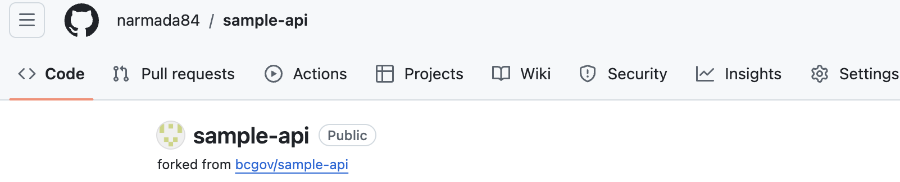
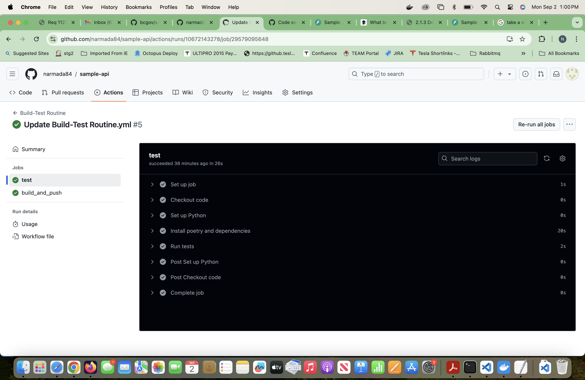
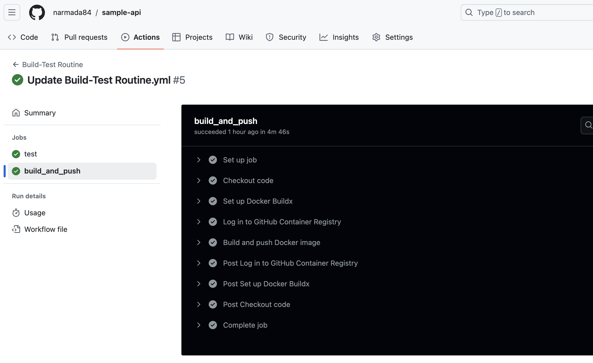
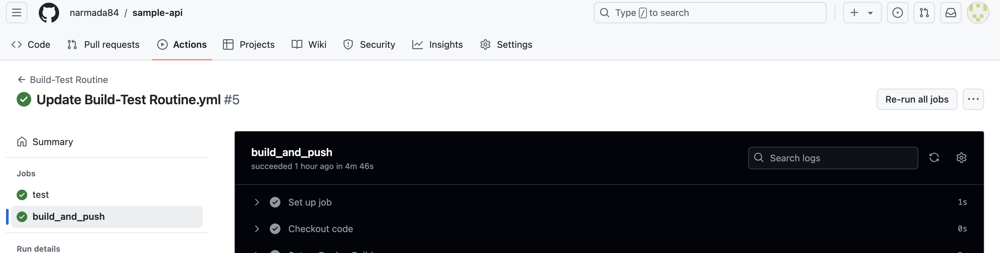

# Image -1 shows Actions tab on the github repo

# Image shows the success run of the test cases using github workflows 

# Image-2 show the successful run of the build and push docker image to github registery.

# Image-3 shows how to rerun the selected workflow jobs manually

# Last successful run
https://github.com/narmada84/sample-api/actions/runs/10672143278